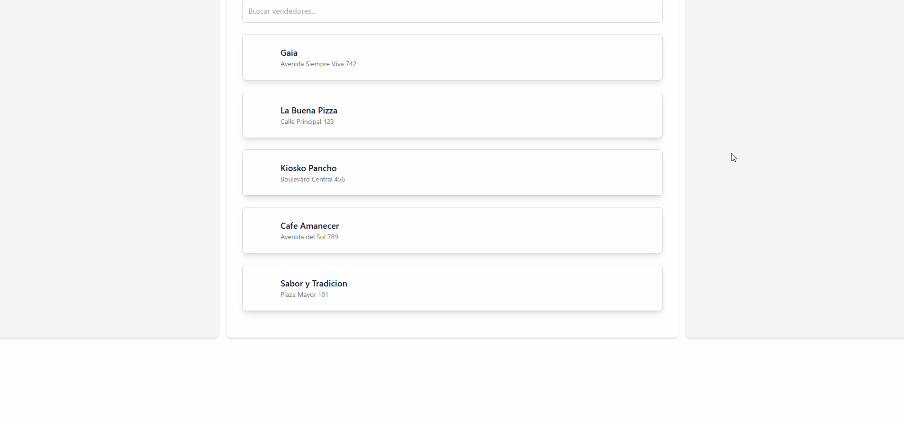

# Proyecto: [Food-Delivery-App]



## Descripción

Este proyecto consiste en una aplicación de pedidos en línea, similar a "Pedidos Ya", que permite a los usuarios realizar pedidos de productos en distintos restaurantes. La plataforma facilita la visualización de menús, la selección de productos y la realización de pedidos de manera sencilla.

Se trata de un prototipo de backend que incluye pruebas visuales de algunas funcionalidades clave del servicio de pedidos. Las pruebas de los endpoints se encuentran en el archivo "foodDelivery.postman_collection.json".

## Tecnologías, Frameworks y APIs

- **Lenguajes:** Java, JavaScript.
- **Frameworks:** Spring Boot, Thymeleaf.
- **Bases de Datos:** MySQL.
- **Estilos y Diseño:** TailwindCSS, PostCSS.
- **Otras herramientas:** Lombok, REST APIs.

## Recursos Adicionales

- **Control de versiones:** Git, GitHub.
- **Gestor de dependencias:** Maven.
- **Testing y pruebas:** Postman, Thunder Client.


## Instalación y Ejecución

1. Clona este repositorio en tu máquina local:

   ```bash
   git clone https://github.com/Seba02-sr/food-delivery-app-web.git

2. Navega al directorio del proyecto:
    ```bash
    cd nombre-del-proyecto

3. Ejecuta el proyecto utilizando Maven:
    ```bash
    mvn spring-boot:run

## Prueba de Pedido por Postman
Para realizar prueba de pedidos en Postman, ejecute las siguientes solicitudes en el orden indicado:

1. "Guardar Pedido"
2. "Actualizar Pedido ACEPTADO"
3. "Actualizar Pedido PAGADO"

## Licencia
Este proyecto está licenciado bajo la Licencia MIT - ver el archivo [LICENSE](LICENSE) para más detalles.
